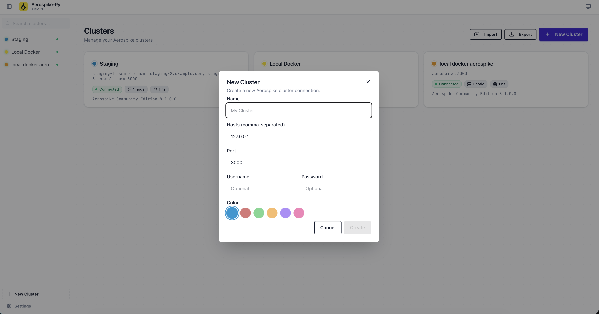
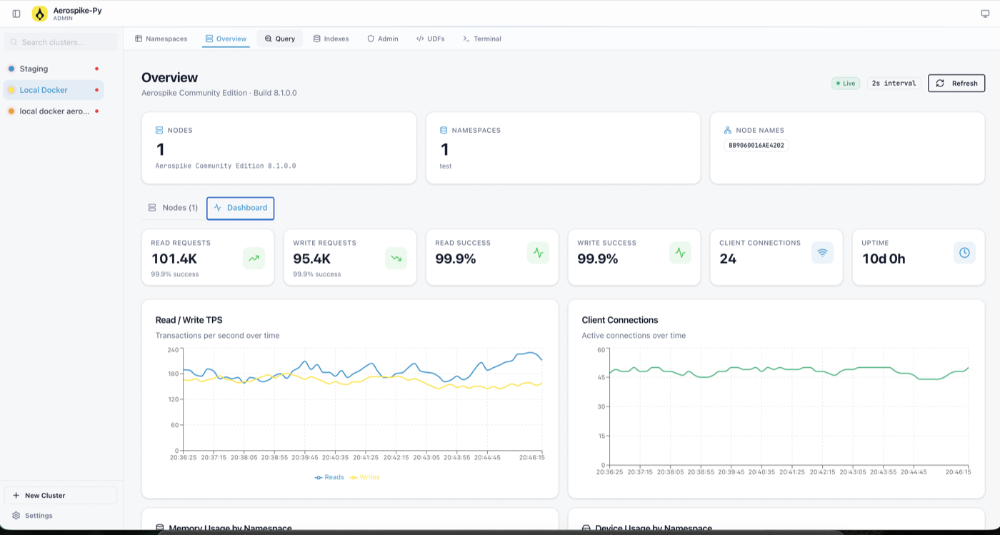
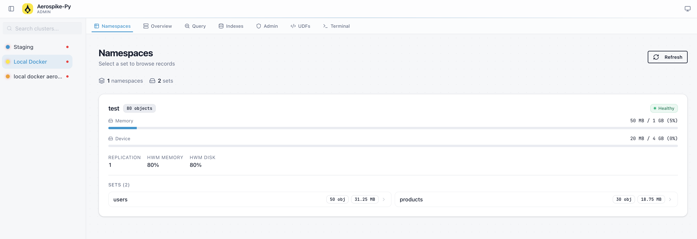
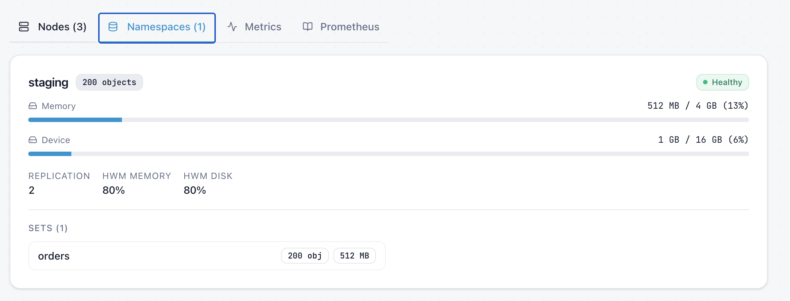
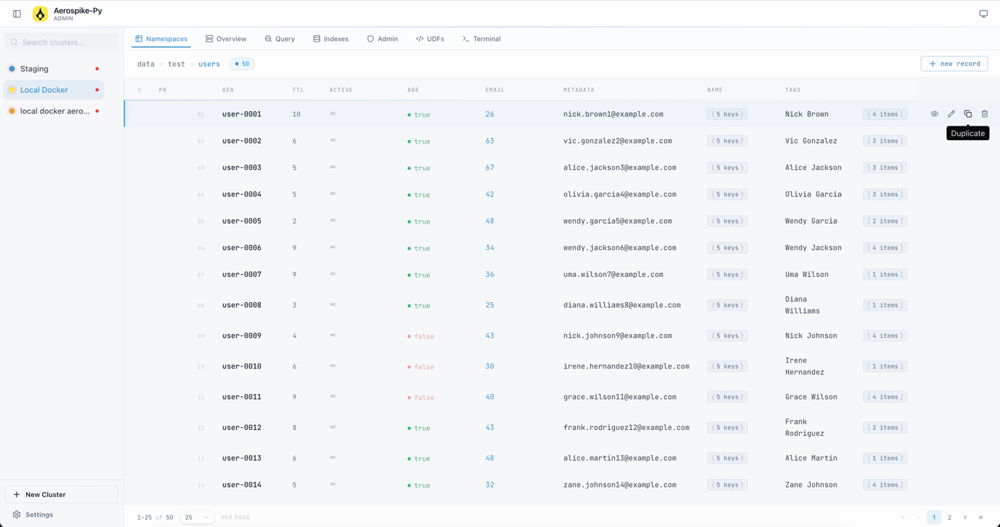

# Aerospike Cluster Manager

[](https://github.com/KimSoungRyoul/aerospike-cluster-manager/actions/workflows/ci.yaml)
[](https://github.com/KimSoungRyoul/aerospike-cluster-manager/actions/workflows/cd.yaml)


[](LICENSE)

A web-based GUI management tool for Aerospike Community Edition.

Provides cluster monitoring, record browsing, query execution, index management, user/role management, UDF management, AQL terminal, and more.

## Overview

### Cluster Management

Manage multiple Aerospike cluster connections with color-coded profiles. Create, edit, test, import and export connections.



### Cluster Dashboard

Real-time monitoring with live TPS charts, client connections, read/write success rates, and uptime tracking.



### Namespaces & Sets

Browse namespaces with memory/device usage, replication factor, HWM thresholds, and navigate into sets.





### Record Browser

Browse, create, edit, duplicate and delete records with full pagination support.



## Tech Stack

| Layer | Stack |
|---|---|
| **Frontend** | Next.js 16, React 19, TypeScript, Tailwind CSS 4, DaisyUI 5, Zustand, TanStack Table, Recharts, Monaco Editor |
| **Backend** | Python 3.13, FastAPI, Uvicorn, Pydantic |
| **Database** | Aerospike Server Enterprise 8.0 |
| **Infra** | Podman Compose, uv (Python), npm (Node.js) |

## Quick Start

### Podman Compose (Recommended)

```bash
cp .env.example .env
podman compose -f compose.yaml up --build
```

- Frontend: http://localhost:3100
- Backend API: http://localhost:8000
- Aerospike: internal network only (use `podman exec -it aerospike-tools aql -h aerospike-node-1`)

### Local Development

**Backend:**
```bash
cd backend
uv sync                            # Install dependencies
uv run uvicorn aerospike_cluster_manager_api.main:app --reload
```

**Frontend:**
```bash
cd frontend
npm install                        # Install dependencies
npm run dev                        # http://localhost:3000
```

> The frontend dev server proxies `/api/*` requests to `http://localhost:8000`.

## Features

- **Connection Management** — Manage multiple Aerospike cluster connection profiles
- **Cluster Overview** — Node status, namespaces, real-time metrics monitoring
- **Record Browser** — Namespace/set browsing, record CRUD, pagination
- **Query Builder** — Scan/Query execution, predicate-based filtering
- **Index Management** — Secondary index creation/deletion
- **Admin** — User/role CRUD (with CE limitation indicators)
- **UDF Management** — Lua UDF upload/delete
- **AQL Terminal** — Web-based AQL command execution
- **Prometheus Metrics** — Cluster metrics export
- **Light/Dark Mode** — System theme integration

## Project Structure

```
aerospike-cluster-manager/
├── backend/                # FastAPI REST API
│   ├── src/aerospike_cluster_manager_api/
│   │   ├── main.py         # App entry point
│   │   ├── models/         # Pydantic models
│   │   ├── routers/        # API endpoints
│   │   └── mock_data/      # Dev mock data
│   ├── Dockerfile
│   └── pyproject.toml
├── frontend/               # Next.js App Router
│   ├── src/
│   │   ├── app/            # Pages & routing
│   │   ├── components/     # UI components
│   │   ├── stores/         # Zustand state
│   │   ├── hooks/          # Custom hooks
│   │   └── lib/            # API client, utils, types
│   ├── Dockerfile
│   └── package.json
├── compose.yaml            # Full stack (all containers)
├── compose.dev.yaml        # Aerospike only (for local dev)
└── .env.example
```

## Development

### Testing

```bash
cd frontend
npm run test              # Unit tests (Vitest)
npm run test:coverage     # With coverage report
npm run test:e2e          # E2E tests (Playwright)
```

### Code Quality

```bash
# Frontend
cd frontend
npm run lint              # ESLint
npm run format:check      # Prettier check
npm run type-check        # TypeScript

# Backend
cd backend
uv run ruff check src     # Lint
uv run ruff format src    # Format

# Pre-commit (both)
pre-commit run --all-files
```

## Environment Variables

| Variable | Default | Description |
|---|---|---|
| `AEROSPIKE_HOST` | `aerospike` | Aerospike server host |
| `AEROSPIKE_PORT` | `3000` | Aerospike service port |
| `BACKEND_PORT` | `8000` | Backend API port |
| `FRONTEND_PORT` | `3100` | Frontend port |
| `CORS_ORIGINS` | `http://localhost:3100` | Allowed CORS origins |
| `BACKEND_URL` | `http://localhost:8000` | Backend URL (frontend proxy target) |

## License

This project is licensed under the [Apache License 2.0](LICENSE).
